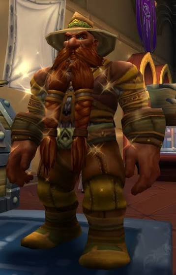

# About BRAN Org (Brazilian Research Archive Network)

  
  
  
  

---

## Who We Are & Our Mission

**BRAN Org** (**Brazilian Research Archive Network**) is an independent technological infrastructure collective dedicated to **rescuing, structuring, and preserving Brazil's scientific and bibliometric memory**.

Our focus is on **academic data that is already public, yet trapped in a technological void**: conference proceedings, symposia of academic societies, graduate research meetings, and regional journals lacking APIs, programmatic access, or facing the imminent threat of digital disappearance (*link rot*).

We harvest, sanitize, enrich, and distribute these archives in **open, standardized formats** through **free public REST APIs**, analytical dashboards, and universal academic exchange standards (`CSV with UTF-8 BOM`, `JSON`, `BibTeX`, and `RIS`), lowering technical barriers for researchers and catalyzing quantitative studies on Brazilian science.

---

## The Diagnosis: "Digital Amnesia" in Brazilian Science

In the international scientific arena, researchers rely on mature, highly integrated ecosystems for academic metadata (*Crossref*, *OpenAlex*, *Semantic Scholar*, *PubMed*, and *Web of Science*). In those environments, high-availability REST APIs, strict JSON Schema data contracts, and persistent identifiers (DOIs) are standard requirements.

In **Brazil**, however, the academic community faces a stark contrast and a critical structural vulnerability:

### 1. The Ephemerality of Proceedings & Historical Amnesia
Thousands of national conferences, academic meetings, and research summits elect new organizing committees periodically. With shifting administrative tenures:
* Web domains expire without renewal;
* Legacy university servers are powered off without accessible archival backups;
* Outdated content management portals suffer database corruption or cyberattacks.

The outcome is **digital amnesia**: hundreds of thousands of research works produced by faculty members, master's and doctoral students, and undergraduate research fellows (PIBIC) vanish from the web, turning decades of genuine scientific work into "phantom citations."

### 2. Proceedings as the "Cradle of Science"
In contemporary research dynamics, **it is within conference proceedings that pioneering hypotheses and novel methodologies are debated for the very first time**, years before maturing into journal articles in high-impact commercial publications.

Losing or neglecting conference proceedings means erasing the very genesis of Brazilian scientific thought.

---

## Our Stance: Symbiosis with Major National Platforms

National governmental and scientific infrastructure initiatives in Brazil — such as **Plataforma Lattes**, the **CAPES/Sucupira** systems, **BDTD/IBICT**, and the recent **Projeto Laguna** — perform an invaluable duty in centralizing researcher CVs, evaluating graduate programs, and indexing mainstream journals.

However, given the massive scale and institutional priorities of these federal portals, substantial portions of the scientific literature remain off the radar:
* Undergraduate research papers and specialized symposia from regional scientific societies;
* Historical archives and "orphan" proceedings published prior to the digital identifier era;
* Fine-grained methodological telemetry (computational tools, algorithms, and data sources employed in research).

**BRAN Org**'s mission is strictly **symbiotic and complementary**. We do not compete with national platforms; instead, we **fill critical frontline infrastructure gaps**, rescuing forgotten archives and curating them to the highest technical standard so they can seamlessly interface with both domestic and international scientific networks.

---

## Scientific Sovereignty & Ethical Artificial Intelligence

**BRAN Org** enforces an explicit dual-licensing policy to defend Brazilian science as an **inalienable public good**:

### 1. Free Software & Copyleft (GNU GPLv3)
All of our codebase (search engines, scientometric analyzers, scrapers, and web templates) is licensed under the **GNU General Public License v3.0**. This guarantees that any improvements, forks, or derivative platforms remain permanently free and open source, preventing proprietary lock-in.

### 2. Protected Scientific Open Data (CC BY-NC-SA 4.0)
Our scientific datasets and metadata are distributed under the **Creative Commons Attribution-NonCommercial-ShareAlike 4.0 International (CC BY-NC-SA 4.0)** license:
* **Free for Non-Commercial Research**: Researchers, students, and academic institutions may explore, analyze, remix, and publish studies utilizing our datasets without cost.
* **Protection Against Commercial Exploitation**: Direct commercialization of these datasets and bulk scraping for proprietary commercial Artificial Intelligence model training without formal authorization and fair reciprocity to the national scientific community are strictly prohibited.

---

## The Inspiration: Why "BRAN"?

The acronym **BRAN** (**Brazilian Research Archive Network**) pays tribute to **Brann Bronzebeard**, a legendary character and explorer from the *World of Warcraft* universe.

In the lore, Brann is the founder of the Explorer's League—a field scholar who ventures into forgotten ruins, recovers historical relics doomed to oblivion, and passionately shares his findings with the entire realm.

This captures the essence of our initiative: **we are academic data archaeologists**. Where others see only outdated PDFs, dead links, and abandoned static websites, we see the living heritage of Brazilian intelligence and scientific discovery ready to be preserved and returned to society.

---

## How to Participate & Institutional Partnerships

BRAN Org is an open, living initiative welcoming collaboration from across the scientific ecosystem:

* **For Academic Societies & Conference Organizers**: If you organize or represent a Brazilian academic conference whose historical proceedings are scattered or lack modern APIs, [open an issue](https://github.com/BRAN-Org/.github/issues) or reach out. We assist in transforming your archives into standardized open databases with guaranteed digital preservation.
* **For Bibliometrics & Information Science Researchers**: Suggest new archives for recovery, contribute metadata corrections, or leverage our open APIs in your theses, dissertations, and research papers.
* **For Developers & Engineers**: Contribute scrapers, enhancements to the `statsEngine` analytics suite, or help build our upcoming `bran-py` Python SDK.

### Contact Channels
* **General Coordination**: [gabrielngama@gmail.com](mailto:gabrielngama@gmail.com)
* **GitHub Issues**: [Central Demand & Discussion Tracker](https://github.com/BRAN-Org/.github/issues)
* **Contributor Guidelines**: Read our [CONTRIBUTING.md](CONTRIBUTING.md) and [CODE_OF_CONDUCT.md](CODE_OF_CONDUCT.md).
