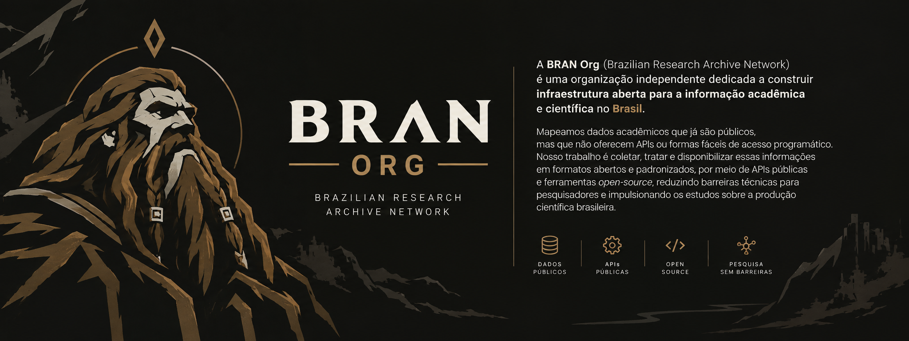

 
 
 
 

 <b><a href="ABOUT.md">Saiba mais sobre nossa história, missão e visão em ABOUT.md</a></b>

---

### Bases de Dados & Acervos

Catálogo público de bases de dados bibliométricos da produção científica brasileira, disponibilizadas em formatos abertos (`JSON`/`CSV`), com API REST gratuita e dashboard interativo para análise.

| Repositório | Evento Oficial | Registros | Confiabilidade |
| :--- | :--- | :---: | :---: |
| [abec-open-database](https://github.com/BRAN-Org/abec-open-database) | [ABEC Meeting](https://www.abecbrasil.org.br/) | **259 Artigos** (2013-2025) | [🟠 Em Averiguação](#-níveis-de-confiabilidade-dos-dados) |
| [ebbc-open-database](https://github.com/BRAN-Org/ebbc-open-database) | [EBBC](https://ebbc.inf.br) | **643 Artigos** (2012-2024) | [🟡 Fiel à Fonte (Cobertura Incompleta)](#-níveis-de-confiabilidade-dos-dados) |

<b>Níveis de Confiabilidade dos Dados</b>

 

Para assegurar transparência acadêmica e rigor metodológico, cada repositório da **BRAN Org** possui uma marcação de confiabilidade dos dados:

- 🟢 **Auditado e Validado**: Dados auditados e validados formalmente em conjunto com os organizadores ou comissão oficial do evento.
- 🟡 **Fiel à Fonte / Cobertura Incompleta**: Os dados reproduzem fielmente tudo o que está publicado no site oficial, mas o acervo original possui lacunas conhecidas (como anos de anais não digitalizados pela organização, ausência de DOIs na origem ou edições históricas faltantes). *(Ex: `ebbc-open-database`)*.
- 🟠 **Em Averiguação**: Dados coletados que estão ativamente sendo averiguados, passando por auditoria técnica de integridade ou aguardando resposta formal da instituição organizadora. *(Ex: `abec-open-database`)*.
- 🔴 **Não Auditado**: Dados brutos ou recém-extraídos que ainda não passaram por averiguação de integridade.

> **Nota Metodológica Oficial:** 
> *A BRAN preserva a fidelidade estrita à fonte de origem e nunca inventa dados inexistentes. Discrepâncias e lacunas identificadas nos portais oficiais são registradas nos relatórios de auditoria e tratadas via averiguação ativa e contato direto com as instituições organizadoras.*

---

## Participe

Esta comunidade possui um [Código de Conduta](CODE_OF_CONDUCT.md). Você deve segui-lo ao interagir com a comunidade.

- **Para dúvidas ou suporte:** veja o [SUPPORT.md](SUPPORT.md) ou envie uma mensagem através do [Formulário de Contato](https://forms.gle/qhVXZpaRo26MLuUm8).
- **Para ajudar ou contribuir:** veja o [CONTRIBUTING.md](CONTRIBUTING.md).
- **Para submeter dados ou acervos:** preencha o [Formulário de Submissão de Datasets](https://forms.gle/jNBuP1mjyUXc6v1fA).