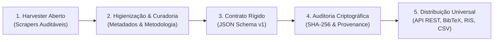

# 🏛️ Sobre a BRAN Org (Brazilian Research Archive Network)

  
  
  
  

---

## 🧭 Quem Somos e Nossa Missão

A **BRAN Org** (**Brazilian Research Archive Network**) é uma organização independente e coletivo de infraestrutura tecnológica dedicado a **resgatar, estruturar e preservar a memória científica e bibliométrica do Brasil**.

Nossa atuação foca nos **dados acadêmicos que já são públicos, mas que permanecem em um limbo tecnológico**: anais de congressos, simpósios de sociedades científicas, encontros de pós-graduação e revistas regionais que não possuem APIs, não oferecem acesso programático ou correm risco iminente de desaparecimento digital (*link rot*).

Coletamos, tratamos, enriquecemos e disponibilizamos esses acervos em **formatos abertos e padronizados**, através de **APIs REST públicas gratuitas**, dashboards analíticos e formatos de intercâmbio acadêmico universal (`CSV UTF-8 BOM`, `JSON`, `BibTeX` e `RIS`), reduzindo barreiras técnicas para pesquisadores e impulsionando os estudos quantitativos sobre a ciência brasileira.

---

## 🌪️ O Diagnóstico: A "Amnésia Digital" na Ciência Brasileira

No cenário científico internacional, pesquisadores dispõem de ecossistemas maduros e integrados para metadados acadêmicos (*Crossref*, *OpenAlex*, *Semantic Scholar*, *PubMed* e *Web of Science*). Nesses ambientes, APIs REST de alta disponibilidade, contratos rígidos em JSON Schema e identificadores persistentes (DOIs) são a regra elementar.

No **Brasil**, contudo, convivemos com um contraste desafiador e uma grave vulnerabilidade estrutural:

### 1. A Efemeridade dos Anais e a Amnésia Histórica
Milhares de congressos, encontros acadêmicos e jornadas científicas nacionais trocam de comissão organizadora periodicamente. Com a troca de gestões:
* Domínios de internet expiram e deixam de ser renovados;
* Servidores institucionais antigos são desligados sem rotinas de backup acessíveis;
* Portais legados sofrem ataques ou corrupção de banco de dados.

O resultado é a **amnésia digital**: centenas de milhares de pesquisas realizadas por professores, mestrandos, doutorandos e bolsistas de iniciação científica (PIBIC) evaporam da internet, transformando trabalhos acadêmicos inteiros em "referências fantasmas".

### 2. Os Anais como o "Berço da Ciência"
Na dinâmica da pesquisa contemporânea, **é nos anais de eventos que as ideias pioneiras e as metodologias disruptivas são debatidas pela primeira vez**, anos antes de maturarem como artigos em periódicos indexados de grande circulação. 

Perder ou negligenciar os anais de congressos significa apagar a gênese do pensamento científico brasileiro.

---

## 🤝 Nossa Postura: Simbiose com as Grandes Plataformas Nacionais

Iniciativas de infraestrutura governamental e acadêmica no Brasil — como a **Plataforma Lattes**, os sistemas da **CAPES/Sucupira**, o **BDTD/IBICT** ou o recente **Projeto Laguna** — cumprem um papel inestimável na consolidação dos currículos de pesquisadores, na avaliação dos programas de pós-graduação e no mapeamento de periódicos consolidados.

Contudo, devido à escala massiva e às prioridades institucionais desses órgãos centrais, parcelas expressivas da literatura científica permanecem fora do radar:
* Trabalhos de iniciação científica e simpósios de sociedades acadêmicas especializadas;
* Acervos históricos e edições "órfãs" anteriores à era dos identificadores digitais;
* Mapeamento fino de metodologias (softwares utilizados, bases consultadas e algoritmos empregados nas pesquisas).

A atuação da **BRAN Org** é estritamente **simbiótica e complementar**. Não buscamos concorrer com as plataformas nacionais, mas sim **preencher as lacunas de infraestrutura na ponta**, resgatando acervos esquecidos e organizando-os com rigor para que estejam aptos a dialogar com as grandes redes de informação globais e nacionais.

---

## 🔬 O Pipeline de Integridade Científica da BRAN Org

Para garantir o **compromisso com a verdade acadêmica**, a não-alucinação de metadados e a integridade de cada registro, todo acervo publicado pela BRAN Org percorre um ciclo rigoroso de 5 etapas:

1. **Harvester Aberto & Reprodutível**: Cada repositório de dados mantém versionado seu código-fonte de extração, permitindo que qualquer membro da comunidade acadêmica audite, reproduza ou aperfeiçoe o processo de coleta.
2. **Higienização & Enriquecimento Metodológico**: Tratamento de anomalias textuais, normalização de caracteres com acentuação e classificação bibliométrica de softwares utilizados e fontes consultadas.
3. **Contratos Formais de Dados (JSON Schema)**: Validação estrita contra especificações padronizadas no repositório canônico [`BRAN-Org/schemas`](https://github.com/BRAN-Org/schemas) (`article.v1.schema.json`, `event.v1.schema.json`, `provenance.v1.schema.json`).
4. **Auditoria Criptográfica de Proveniência**: Cada lote de dados possui um manifesto `provenance.json` contendo o hash criptográfico SHA-256 do arquivo original, timestamp ISO 8601, fonte de origem e classificação formal de confiabilidade (*Health Level*).
5. **Distribuição Universal**: APIs REST de alto desempenho, painéis analíticos interativos e exportação imediata nos formatos analíticos mais demandados pela pesquisa (`CSV` com UTF-8 BOM, `JSON`, `BibTeX` e `RIS`).

---

## 🛡️ Níveis de Confiabilidade dos Dados (Data Health Levels)

Para assegurar transparência metodológica a bibliometristas e cientistas de dados, todo dataset é classificado formalmente:

* 🟢 **Verde (100% Auditado & Completo)**: Registros totalmente auditados, higienizados e validados. Contém todos os metadados fundamentais (título, autores, afiliações, resumos, DOIs e links para PDF) sem lacunas estruturais.
* 🔵 **Azul (Alta Fidelidade com Omissões Esparsas da Fonte)**: Cobertura completa de edições/anos e DOIs, contendo apenas raras ausências de metadados herdadas do próprio portal original.
* 🟡 **Amarelo (100% Fiel à Fonte com Limitações Nativas da Origem)**: 100% dos trabalhos disponíveis online foram resgatados sem perda, porém a fonte oficial apresenta limitações históricas (ex: anais dos anos iniciais não digitalizados pela organização original ou ausência nativa de DOIs). *(Ex: `ebbc-open-database`)*.
* 🟠 **Laranja (Em Curadoria / Saneamento Metodológico)**: Coleta realizada com sucesso, mas o acervo passa por etapas ativas de curadoria e padronização. *(Ex: `abec-open-database`)*.
* 🔴 **Vermelho (Dados Não Auditados / Baixa Confiabilidade)**: Registros preliminares que exigem cautela para uso analítico direto.

---

## ⚖️ Soberania Científica & Inteligência Artificial Ética

A **BRAN Org** adota uma política expressa de licenciamento dual para defender a ciência brasileira como um **bem público inegociável**:

### 1. Software Livre & Copyleft (GNU GPLv3)
Todo o nosso código-fonte (motores de busca, analisadores estatísticos, scrapers e templates) é licenciado sob a **GNU General Public License v3.0**. Isso assegura que qualquer melhoria, modificação ou ferramenta derivada permaneça perpetuamente aberta para a comunidade científica, impedindo o fechamento proprietário do código.

### 2. Dados Públicos Protegidos (CC BY-NC-SA 4.0)
Nossos datasets e metadados científicos são distribuídos sob a licença **Creative Commons Atribuição-NãoComercial-CompartilhaIgual 4.0 Internacional**:
* **Livre para Pesquisa**: Pesquisadores, estudantes e instituições podem explorar, cruzar, analisar e publicar estudos acadêmicos livremente a partir de nossas bases.
* **Proteção contra Apropriação Comercial**: É expressamente vedada a comercialização direta desses dados ou sua raspagem em massa para treinamento e enriquecimento de modelos comerciais de Inteligência Artificial de terceiros sem autorização formal e contrapartida para a comunidade científica nacional.

---

## ⛏️ A Inspiração: Por que "BRAN"?

A sigla **BRAN** (**Brazilian Research Archive Network**) presta uma homenagem afetuosa a **Brann Bronzebeard**, lendário personagem e explorador do universo de *World of Warcraft*.

No jogo, Brann é o fundador da Liga dos Exploradores (*Explorer's League*), um pesquisador que se recusa a ficar em gabinetes: ele viaja para cantos remotos do mundo, escava ruínas esquecidas, recupera artefatos históricos condenados ao esquecimento e insiste em compartilhar suas descobertas com todas as pessoas.

Essa figura resume o espírito do nosso projeto: **somos arqueólogos de dados acadêmicos**. Onde muitos enxergam apenas PDFs antigos, links mortos e páginas estáticas esquecidas, nós enxergamos a memória viva da inteligência e da ciência brasileira pronta para ser resgatada e devolvida à sociedade.

---

## 🤝 Como Participar & Parcerias Institucionais

A BRAN Org é um projeto vivo e aberto para toda a comunidade científica:

* **Para Sociedades Científicas e Comissões de Eventos**: Se você organiza ou representa um congresso acadêmico brasileiro cujos anais históricos estão dispersos ou sem API, [abra uma issue](https://github.com/BRAN-Org/.github/issues) ou entre em contato. Ajudamos a converter seus anais em uma base de dados moderna com preservação digital garantida.
* **Para Pesquisadores em Bibliometria e Ciência da Informação**: Sugira novos acervos para resgate, contribua com correções de metadados ou utilize nossas APIs em suas dissertações e artigos.
* **Para Desenvolvedores**: Contribua com novos scrapers, melhorias nos algoritmos do `statsEngine` ou no desenvolvimento do SDK `bran-py`.

### Canais de Contato
* **Coordenação Geral**: [gabrielngama@gmail.com](mailto:gabrielngama@gmail.com)
* **GitHub Issues**: [Repositório Central de Demandas & Discussões](https://github.com/BRAN-Org/.github/issues)
* **Diretrizes para Colaboradores**: Consulte nosso [CONTRIBUTING.md](CONTRIBUTING.md) e o [CODE_OF_CONDUCT.md](CODE_OF_CONDUCT.md).

