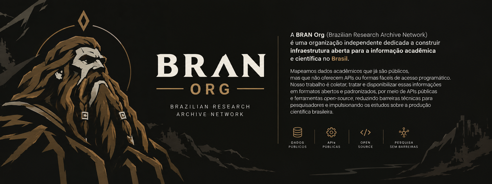

  
  
  
  

  📖 <b><a href="ABOUT.en.md">Learn more about our story, mission, and vision in ABOUT.en.md</a></b>

---

### Databases & Collections

Public catalog of bibliometric databases from Brazilian scientific output, provided in open formats (`JSON`/`CSV`), featuring a free REST API and interactive dashboard for analysis.

| Repository | Official Event | Records | Data Reliability |
| :--- | :--- | :---: | :---: |
| [abec-open-database](https://github.com/BRAN-Org/abec-open-database) | [ABEC Meeting](https://www.abecbrasil.org.br/) | **259 Articles** (2013-2025) | [🟠 In Curation](#-data-reliability-levels) |
| [ebbc-open-database](https://github.com/BRAN-Org/ebbc-open-database) | [EBBC](https://ebbc.inf.br) | **643 Articles** (2012-2024) | [🟡 Source Faithful (Limitations)](#-data-reliability-levels) |

<b>Data Reliability Levels</b>

 

To ensure academic transparency and scientific rigor, every **BRAN Org** dataset features a data reliability tier:

- 🟢 **Green (100% Audited & Complete)**: Fully extracted, validated, and sanitized. Contains all fundamental metadata (title, authors, affiliations, abstracts, DOIs, and PDF links) without known structural gaps.
- 🔵 **Blue (High Fidelity with Sparse Source Omissions)**: Complete coverage of editions/years and DOIs, containing only rare metadata gaps inherited directly from the official website in specific editions.
- 🟡 **Yellow (100% Faithful to Source with Native Limitations)**: 100% of articles available online on the official website were extracted without loss, but the official source presents native limitations (e.g., lack of DOIs in proceedings or missing early historical proceedings not digitized online). *(Ex: `ebbc-open-database`)*.
- 🟠 **Orange (In Curation / Processing)**: Extraction completed successfully, but the collection is undergoing curation, schema validation, and metadata sanitation. *(Ex: `abec-open-database`)*.
- 🔴 **Red (Unaudited Data / Low Reliability)**: Unaudited raw records or high incidence of extraction errors. Requires caution for direct analytical use.

---

## 🤝 Get Involved

This community has a [Code of Conduct](CODE_OF_CONDUCT.md). You must follow it when interacting with the community.

- **For questions or support:** see [SUPPORT.md](SUPPORT.md) or send a message via our [Contact Form](https://forms.gle/bran-org-contato).
- **To help or contribute:** see [CONTRIBUTING.md](CONTRIBUTING.md).
