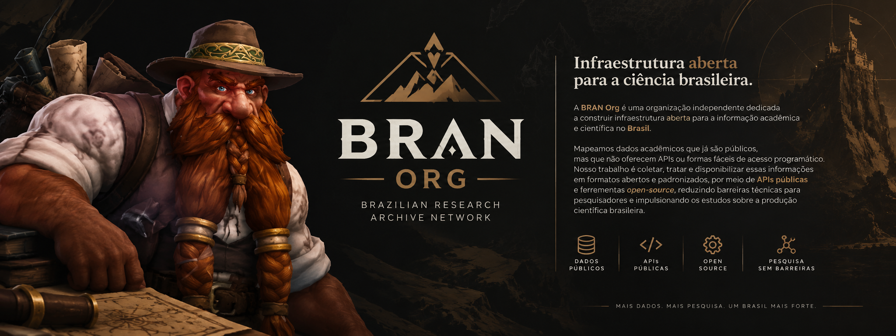

  
  
  
  

## 💡 Sobre a BRAN Org

A **BRAN Org** (**Brazilian Research Archive Network**) é uma organização independente dedicada a construir infraestrutura aberta para a informação acadêmica e científica no **Brasil**.

👉 **[Se quiser saber mais sobre a gente, nossa missão, nossos objetivos, projetos e nossa história completa, acesse o nosso ABOUT.md!](ABOUT.md)**

---

## Como contribuir
Convidamos pesquisadores, desenvolvedores e entusiastas da ciência aberta a colaborar conosco:
- **Sugerir fontes de dados**: Conhece uma base acadêmica brasileira pública que precisa de uma API? [Envie sua sugestão pelo formulário](https://forms.google.com/sua-url-de-sugestao-aqui).
- **Desenvolver e aprimorar**: Colaborar no desenvolvimento das nossas APIs e ferramentas no GitHub.
- **Abrir Issues**: Enviar feedbacks, correções de bugs ou idéias diretamente nos nossos repositórios.
- **Divulgar**: Compartilhar nossas ferramentas com pesquisadores e a comunidade acadêmica.

## Princípios
Nossa atuação é guiada pelos princípios e declarações internacionais de Ciência Aberta:

- **[Princípios FAIR](https://www.go-fair.org/fair-principles/)**: Compromisso em disponibilizar dados **Localizáveis, Acessíveis, Interoperáveis e Reutilizáveis** (*Findable, Accessible, Interoperable, Reusable*).
- **[Budapest Open Access Initiative (BOAI)](https://www.budapestopenaccessinitiative.org/)**: Alinhamento com as diretrizes históricas de Acesso Aberto para o livre uso, distribuição e reutilização do conhecimento científico.
- **Proteção dos Dados Científicos (CC BY-NC-SA 4.0)**: Acesso livre para pesquisa acadêmica não-comercial, com restrição expressa contra raspagem/ingestão para treino comercial de modelos de Inteligência Artificial sem autorização.
- **Software Livre & Copyleft (GPLv3)**: Código-fonte 100% aberto sob a licença GNU GPLv3, garantindo que qualquer melhoria ou ferramenta derivada permaneça aberta.
- **Transparência**: Processos de coleta, tratamento e documentação abertos e auditáveis pela comunidade.

## Contato
- **Formulário de Contato**: [Envie uma mensagem pelo formulário](https://forms.google.com/sua-url-de-contato-aqui)
- **E-mail**: [gabrielngama@gmail.com](mailto:gabrielngama@gmail.com)